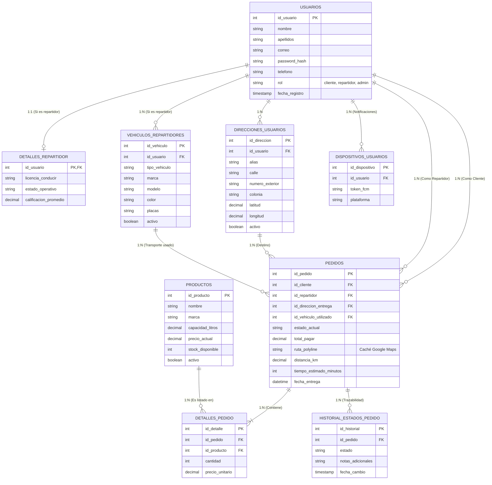

# H2ToGo

##Arquitectura de base de datos

```mermaid
erDiagram
    %% Relaciones de la Entidad Usuarios
    USUARIOS ||--o| DETALLES_REPARTIDOR : "1:1 (Si es repartidor)"
    USUARIOS ||--o{ VEHICULOS_REPARTIDORES : "1:N (Si es repartidor)"
    USUARIOS ||--o{ DIRECCIONES_USUARIOS : "1:N"
    USUARIOS ||--o{ DISPOSITIVOS_USUARIOS : "1:N (Notificaciones)"
    
    %% Relaciones con Pedidos
    USUARIOS ||--o{ PEDIDOS : "1:N (Como Cliente)"
    USUARIOS ||--o{ PEDIDOS : "1:N (Como Repartidor)"
    DIRECCIONES_USUARIOS ||--o{ PEDIDOS : "1:N (Destino)"
    VEHICULOS_REPARTIDORES ||--o{ PEDIDOS : "1:N (Transporte usado)"
    
    %% Relaciones de Detalle y Catálogo
    PEDIDOS ||--|{ DETALLES_PEDIDO : "1:N (Contiene)"
    PRODUCTOS ||--o{ DETALLES_PEDIDO : "1:N (Es listado en)"
    
    %% Auditoría
    PEDIDOS ||--o{ HISTORIAL_ESTADOS_PEDIDO : "1:N (Trazabilidad)"

    %% Definición de Estructuras (Tablas)
    USUARIOS {
        int id_usuario PK
        string nombre
        string apellidos
        string correo
        string password_hash
        string telefono
        string rol "cliente, repartidor, admin"
        timestamp fecha_registro
    }

    DETALLES_REPARTIDOR {
        int id_usuario PK, FK
        string licencia_conducir
        string estado_operativo
        decimal calificacion_promedio
    }

    VEHICULOS_REPARTIDORES {
        int id_vehiculo PK
        int id_usuario FK
        string tipo_vehiculo
        string marca
        string modelo
        string color
        string placas
        boolean activo
    }

    DIRECCIONES_USUARIOS {
        int id_direccion PK
        int id_usuario FK
        string alias
        string calle
        string numero_exterior
        string colonia
        decimal latitud
        decimal longitud
        boolean activo
    }

    PRODUCTOS {
        int id_producto PK
        string nombre
        string marca
        decimal capacidad_litros
        decimal precio_actual
        int stock_disponible
        boolean activo
    }

    DISPOSITIVOS_USUARIOS {
        int id_dispositivo PK
        int id_usuario FK
        string token_fcm
        string plataforma
    }

    PEDIDOS {
        int id_pedido PK
        int id_cliente FK
        int id_repartidor FK
        int id_direccion_entrega FK
        int id_vehiculo_utilizado FK
        string estado_actual
        decimal total_pagar
        string ruta_polyline "Caché Google Maps"
        decimal distancia_km
        int tiempo_estimado_minutos
        datetime fecha_entrega
    }

    DETALLES_PEDIDO {
        int id_detalle PK
        int id_pedido FK
        int id_producto FK
        int cantidad
        decimal precio_unitario
    }

    HISTORIAL_ESTADOS_PEDIDO {
        int id_historial PK
        int id_pedido FK
        string estado
        string notas_adicionales
        timestamp fecha_cambio
    }
```
